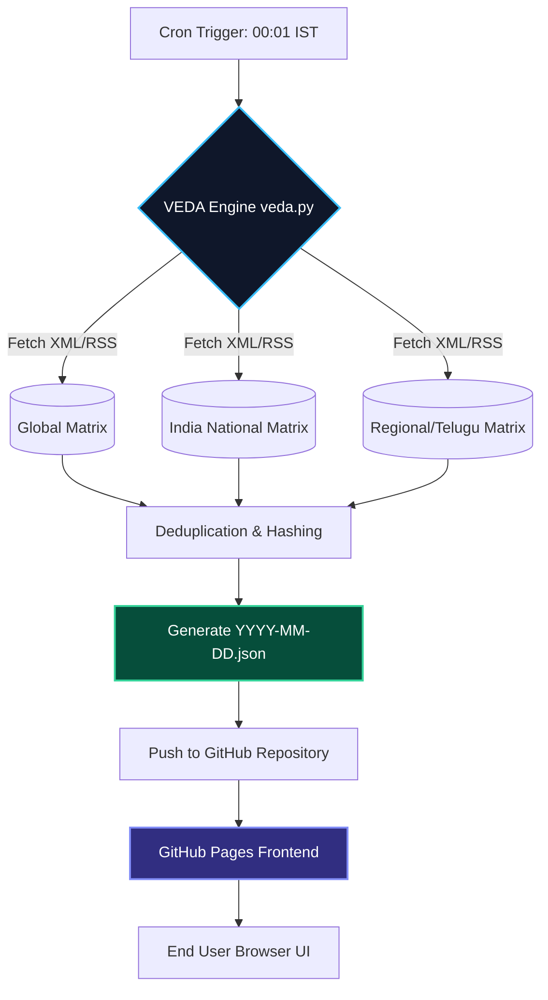

# VEDA: Virtual Intelligence & Data Archive
### The Ultimate Autonomous OSINT Matrix


---
## The Vision: What is VEDA?
VEDA (Virtual Intelligence & Data Archive) is a fully autonomous, serverless Open-Source Intelligence (OSINT) aggregator. It acts as a permanent, immutable record of global history as it unfolds. 
Every day, the VEDA engine wakes up, stealthily sweeps over 30 top-tier global and regional news syndicates (from the New York Times to regional Telugu heavyweights), extracts the raw data, deduplicates it, and permanently freezes it into a lightweight JSON archive. 
In an era of fleeting digital information, stealth-edits, and paywalls, VEDA ensures that every significant global and regional shift is captured, organized, and archived in a searchable format forever.
---
## Technical Architecture & Workflow
VEDA operates entirely without human intervention, utilizing a serverless pipeline. 

## The Philosophy of Permanence
### Why do we Archive this?
The modern internet is volatile. News outlets frequently alter headlines, delete articles, or mask historical data behind premium paywalls. By pulling the raw feeds daily and storing them as JSON, we create a "Time-Machine" of data. If you want to know exactly what the global matrix was reporting on April 27th, 2026, VEDA has the frozen, unedited snapshot.
### What is GitHub Pages Hosted?
Instead of paying for expensive cloud servers (AWS/GCP) and heavy SQL databases, VEDA uses GitHub Pages.
 * **Zero Cost & Infinite Scale:** GitHub provides enterprise-grade global CDN hosting for free.
 * **Client-Side Rendering:** Our index.html is a masterclass in frontend optimization. It fetches the static JSON files directly from the repository and renders them dynamically in the user's browser.
 * **No Database Needed:** The file system (/2026/2026-04-27.json) *is* the database. It is un-hackable, completely static, and lightning-fast.
## Core Toolstack

| Component | Technology | Purpose |
| :--- | :--- | :--- |
| **Data Engine** | Python 3.12 | Handles URL fetching, XML parsing, and MD5 Hashing. |
| **Automation** | GitHub Actions | Serverless execution of the daily intelligence sweep. |
| **Storage** | JSON / Git | Version-controlled, immutable history of reports. |
| **Frontend UI** | HTML5 / Vanilla JS | Premium, shape-shifting UI with real-time omni-search. |

## System Pros & Cons: Deep Analysis and Strategic Roadmap
Building a massive aggregator entirely on static architecture comes with distinct advantages and specific challenges. Here is a detailed breakdown of our strengths and the precise engineering roadmap to conquer our current limitations.
### The System Pros Explained
 1. **Absolute Autonomy**
   * **Explanation:** The system requires zero daily maintenance.
   * **How it is achieved:** GitHub Actions executes a YAML workflow file every day at 00:01 IST. It spins up a virtual Ubuntu server, runs veda.py, automatically commits the new JSON file, and pushes it back to the repository. The process is completely hands-off.
 2. **Extreme Speed**
   * **Explanation:** The user interface loads almost instantaneously, bypassing the typical loading spinners seen on modern news sites.
   * **How it is achieved:** There is no backend server calculating queries. When a user selects a date, the vanilla JavaScript fetches a pre-compiled, lightweight static JSON file directly from GitHub's global CDN, parsing it in milliseconds.
 3. **Memory Efficiency & DOM Protection**
   * **Explanation:** Browsers freeze when forced to load thousands of graphical elements simultaneously. VEDA prevents this.
   * **How it is achieved:** The JavaScript actively slices the data array. It sorts all articles by their exact timestamp, isolates the absolute newest breaking story to pin at the top, limits the total rendered cards to exactly 100 or 500 based on user preference, and discards the rest from memory before building the HTML.
### The System Cons & The Engineering Solutions
**Con 1: Search Limitations (The Omni-Search Boundary)**
 * **The Problem:** Currently, the JavaScript omni-search only filters the *currently selected day*. Because the database consists of thousands of separate JSON files, a user cannot easily search for a keyword (e.g., "Elections") across the entire year without manually clicking through every single day.
 * **How we will solve it (Q3 2026):** We will implement a "Master Indexer" in the Python script. After downloading the daily news, the script will append the new keywords to a lightweight, unified search-index.json file. The frontend will download this single index file on load, allowing the user to search across years instantly, mapping their query directly to the correct historical date file.
**Con 2: Feed Timeout Failures**
 * **The Problem:** Internet networks are unpredictable. If a target news website (like The Hindu or NYT) is temporarily down or experiencing a server hiccup at exactly 00:01 IST, the current urllib request fails, logs a 0 in the telemetry, and misses that day's news for that specific source entirely.
 * **How we will solve it (Q4 2026):** We will transition the Python engine from synchronous urllib to asynchronous aiohttp and asyncio. We will program an "Exponential Backoff" algorithm. If a feed fails, the script will not give up immediately; it will wait 5 seconds and try again, then 15 seconds, then 60 seconds. This ensures temporary server blips do not cause permanent holes in our archive.
**Con 3: UI Data Saturation (Information Overload)**
 * **The Problem:** As we add more regional and specialized feeds to the target matrix, a single day's JSON file can exceed 500+ headlines. For the end-user, scrolling through 500 raw headlines becomes exhausting and defeats the purpose of "intelligence summarization."
 * **How we will solve it (Q1 2027):** We will introduce AI-Powered Semantic Clustering. We will integrate the Gemini LLM API directly into the Python pipeline. Before saving the final JSON, the LLM will scan all 500 headlines, identify overlaps (e.g., 8 different newspapers reporting on the same policy change), and cluster them into a single, unified "Intelligence Briefing Card." The UI will then present a clean, digestible summary of the event, with dropdown links to the 8 underlying source articles.
## Target Matrix (Sources Monitored)
VEDA currently intercepts data from over 30 distinct global nodes:
 * **Global Superpowers:** NYT, Washington Post, BBC, France24, Al Jazeera.
 * **India National Core:** The Hindu, Indian Express, NDTV, Times of India.
 * **Financial Markets:** Moneycontrol, LiveMint, Economic Times.
 * **Telugu Heavyweights:** Namasthe Telangana, NTV, ABP Desam, V6 Velugu.
## Local Setup & Execution
If you wish to run the VEDA engine locally:
 1. **Clone the Repository:**
   ```bash
   git clone [https://github.com/YOUR_USERNAME/VEDA.git](https://github.com/YOUR_USERNAME/VEDA.git)
   cd VEDA
   
   ```
 2. **Run the Archive Engine:**
   ```bash
   python veda.py
   
   ```
   *Note: This will immediately sweep the network, create the YYYY folder, and generate today's JSON archive in IST.*
 3. **Launch the Matrix:**
   Open index.html in your web browser to view the localized frontend.
*End of Line. Generated by the VEDA Core Architecture Team.*
```
